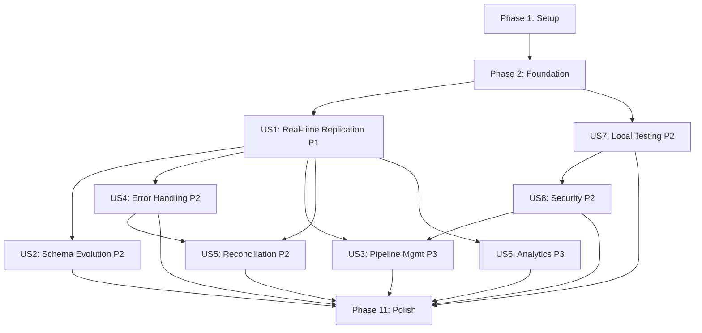

# Tasks: MongoDB CDC to Delta Lake Pipeline

**Input**: Design documents from `/specs/001-mongodb-cdc-delta/`
**Prerequisites**: plan.md ✓, spec.md ✓, research.md ✓

**Tests**: TDD approach enforced - tests MUST be written BEFORE implementation for all components.

**Organization**: Tasks are grouped by user story to enable independent implementation and testing of each story.

## Format: `[ID] [P?] [Story] Description`

- **[P]**: Can run in parallel (different files, no dependencies)
- **[Story]**: Which user story this task belongs to (e.g., US1, US2, US3)
- Include exact file paths in descriptions

## Path Conventions

This is a multi-service architecture:
- **docker/**: Infrastructure and orchestration
- **api/**: FastAPI management service
- **delta-writer/**: Kafka consumer → Delta Lake writer
- **reconciliation/**: Reconciliation engine
- **shared/**: Common utilities
- **tests/**: E2E and cross-service tests

---

## Phase 1: Setup (Shared Infrastructure)

**Purpose**: Project initialization and basic structure for all services

- [X] T001 Create root project structure with docker/, api/, delta-writer/, reconciliation/, shared/, tests/, config/, scripts/, docs/ directories
- [X] T002 Initialize Python monorepo with pyproject.toml at root for shared configuration (Black, Ruff, mypy)
- [X] T003 [P] Create .pre-commit-config.yaml with Black, Ruff, mypy, Bandit, isort hooks
- [X] T004 [P] Create .gitignore for Python, Docker, IDE files
- [X] T005 [P] Create Makefile with targets: build, test, lint, format, up, down, clean
- [X] T006 [P] Create README.md with project overview and quick start
- [X] T007 Create docker/.dockerignore file

---

## Phase 2: Foundational (Blocking Prerequisites)

**Purpose**: Core infrastructure that MUST be complete before ANY user story can be implemented

**⚠️ CRITICAL**: No user story work can begin until this phase is complete

### Docker Compose Infrastructure

- [X] T008 Create docker/compose/docker-compose.yml with MongoDB, Kafka, Zookeeper, Kafka Connect, MinIO, PostgreSQL services
- [X] T009 [P] Create docker/compose/docker-compose.test.yml for test environment with isolated networks
- [X] T010 [P] Create docker/monitoring/prometheus/prometheus.yml with scrape configs for all services
- [X] T011 [P] Create docker/monitoring/grafana/dashboards/ directory with CDC metrics dashboard JSON
- [X] T012 [P] Create docker/monitoring/jaeger/config.yml for distributed tracing
- [X] T013 [P] Create docker/kafka-connect/Dockerfile extending confluent-kafka-connect with Debezium connector
- [X] T014 Create config/kafka-connect/debezium-mongodb.json connector configuration template
- [X] T015 Create config/vault/policies/ directory with service-specific Vault policies

### Shared Python Libraries

- [X] T016 Create shared/logging/structured_logger.py with structlog configuration
- [X] T017 [P] Create shared/tracing/otel_config.py for OpenTelemetry setup
- [X] T018 [P] Create shared/metrics/prometheus_metrics.py with common metric definitions
- [X] T019 [P] Create shared/security/vault_client.py for HashiCorp Vault integration
- [X] T020 [P] Create shared/security/crypto.py with encryption utilities
- [X] T021 [P] Create shared/models/common.py with shared Pydantic models (PipelineConfig base, etc.)

### Testing Infrastructure

- [X] T022 Create tests/testcontainers/containers.py with reusable MongoDB, Kafka, MinIO container configurations
- [X] T023 [P] Create tests/fixtures/sample_documents.json with test MongoDB documents
- [X] T023a [P] Create tests/fixtures/schema_evolution_samples.json with nested docs, missing fields, type variations for FR-007-FR-011 testing
- [X] T024 [P] Create tests/load/data_generators/mongodb_seeder.py using Faker and Mimesis
- [X] T025 [P] Create tests/load/data_generators/change_generator.py for simulating CDC events
- [X] T026 Create pytest.ini at root with test configuration and markers

### Scripts

- [X] T027 Create scripts/setup-local.sh to initialize local environment (Vault unsealing, MinIO buckets, etc.)
- [X] T028 [P] Create scripts/seed-mongodb.sh to populate test data
- [X] T029 [P] Create scripts/create-pipeline.sh to create CDC pipeline via API

**Checkpoint**: Foundation ready - user story implementation can now begin in parallel

---

## Phase 3: User Story 1 - Real-time Data Replication (Priority: P1) 🎯 MVP

**Goal**: Capture MongoDB changes (insert/update/delete) and replicate to Delta Lake in real-time

**Independent Test**: Insert/update/delete documents in MongoDB → verify changes appear in Delta Lake within 60 seconds

### Tests for User Story 1 (TDD - Write FIRST) ⚠️

> **NOTE: Write these tests FIRST, ensure they FAIL before implementation**

- [X] T030 [P] [US1] Contract test for Debezium change event schema in tests/contract/test_debezium_events.py
- [X] T031 [P] [US1] Contract test for Delta Lake table schema in tests/contract/test_delta_schema.py
- [X] T032 [P] [US1] Unit test for BSON to Delta type conversion in tests/unit/test_bson_to_delta.py
- [X] T033 [P] [US1] Unit test for Delta Lake write operations in tests/unit/test_delta_writer.py
- [ ] T034 [US1] Integration test for MongoDB insert → Delta Lake in tests/integration/test_cdc_insert.py using Testcontainers (SKELETON - TODO)
- [ ] T035 [US1] Integration test for MongoDB update → Delta Lake in tests/integration/test_cdc_update.py (SKELETON - TODO)
- [ ] T036 [US1] Integration test for MongoDB delete → Delta Lake in tests/integration/test_cdc_delete.py (SKELETON - TODO)
- [ ] T037 [US1] E2E test for full CDC flow in tests/e2e/test_cdc_flow.py (SKELETON - TODO)

### Implementation for User Story 1

#### Delta Lake Writer Service

- [X] T038 Create delta-writer/requirements.txt with deltalake, kafka-python, aioboto3, structlog
- [X] T039 Create delta-writer/pyproject.toml for service-specific configuration
- [X] T040 [P] [US1] Create delta-writer/src/config.py with Pydantic Settings for Kafka, MinIO, Delta Lake config (COMPLETE with full implementation)
- [ ] T041 [P] [US1] Create delta-writer/src/transformers/bson_to_delta.py for MongoDB BSON → Arrow type mapping (SKELETON - See IMPLEMENTATION_GUIDE.md)
- [ ] T042 [P] [US1] Create delta-writer/src/transformers/schema_inferrer.py to infer Delta schema from MongoDB documents (SKELETON - See IMPLEMENTATION_GUIDE.md)
- [ ] T043 [P] [US1] Create delta-writer/src/storage/minio_client.py wrapping aioboto3 for S3-compatible operations (SKELETON - See IMPLEMENTATION_GUIDE.md)
- [ ] T044 [US1] Create delta-writer/src/writer/schema_manager.py for Delta Lake schema operations and caching (SKELETON - See IMPLEMENTATION_GUIDE.md)
- [ ] T045 [US1] Create delta-writer/src/writer/delta_writer.py for Delta Lake write operations (SKELETON - See IMPLEMENTATION_GUIDE.md)
- [ ] T046 [US1] Create delta-writer/src/writer/batch_processor.py for batching Kafka records before write (SKELETON - See IMPLEMENTATION_GUIDE.md)
- [ ] T047 [US1] Create delta-writer/src/consumer/event_handler.py to process Debezium change events (SKELETON - See IMPLEMENTATION_GUIDE.md)
- [ ] T048 [US1] Create delta-writer/src/consumer/event_consumer.py main Kafka consumer loop with exactly-once semantics (SKELETON - See IMPLEMENTATION_GUIDE.md)
- [ ] T048a [US1] Tune Kafka consumer batch size and MinIO multipart upload in delta-writer/src/config.py based on load testing to achieve 10K events/sec (CONFIG READY - tune after load testing)
- [ ] T049 [US1] Create delta-writer/src/main.py application entry point (SKELETON - See IMPLEMENTATION_GUIDE.md)
- [ ] T050 [P] [US1] Create delta-writer/Dockerfile for containerized deployment (TODO)
- [ ] T051 [P] [US1] Add delta-writer service to docker/compose/docker-compose.yml (TODO)

#### Kafka Connect & Debezium Configuration

- [ ] T052 [US1] Configure Debezium MongoDB connector JSON in config/kafka-connect/ with snapshot and change stream settings
- [ ] T053 [US1] Create scripts/deploy-connector.sh to deploy Debezium connector to Kafka Connect

### Verification for User Story 1

- [ ] T054 [US1] Run all US1 tests → verify they PASS
- [ ] T055 [US1] Run E2E test: Insert 1000 docs → verify in Delta Lake within 60s
- [ ] T056 [US1] Verify Prometheus metrics for throughput and lag

**Checkpoint**: At this point, basic CDC (insert/update/delete) should work end-to-end

---

## Phase 4: User Story 2 - Schema Evolution Handling (Priority: P2)

**Goal**: Automatically handle MongoDB schema changes (new fields, type changes) without pipeline downtime

**Independent Test**: Add new field to MongoDB documents → verify Delta schema updates automatically without errors

### Tests for User Story 2 (TDD - Write FIRST) ⚠️

- [ ] T057 [P] [US2] Unit test for schema merge logic in tests/unit/test_schema_manager.py
- [ ] T058 [P] [US2] Unit test for type conflict resolution in tests/unit/test_type_resolver.py
- [ ] T059 [US2] Integration test for new field addition in tests/integration/test_schema_evolution.py
- [ ] T060 [US2] Integration test for type changes in tests/integration/test_type_evolution.py
- [ ] T061 [US2] E2E test for nested document schema changes in tests/e2e/test_schema_evolution.py

### Implementation for User Story 2

- [ ] T062 [P] [US2] Enhance delta-writer/src/transformers/schema_inferrer.py with schema merge strategies
- [ ] T063 [P] [US2] Create delta-writer/src/transformers/type_resolver.py for handling type conflicts (int vs float, etc.)
- [ ] T064 [US2] Update delta-writer/src/writer/schema_manager.py to support automatic schema merging (schema_mode='merge')
- [ ] T065 [US2] Update delta-writer/src/writer/delta_writer.py to handle schema evolution during writes
- [ ] T066 [US2] Add schema version tracking to Delta Lake table metadata
- [ ] T067 [P] [US2] Create delta-writer/src/writer/schema_cache.py with TTL-based caching (5 minutes)

### Verification for User Story 2

- [ ] T068 [US2] Run all US2 tests → verify they PASS
- [ ] T069 [US2] Run E2E test: Add field to 1000 docs → verify schema updates without downtime
- [ ] T070 [US2] Verify no pipeline restarts during schema changes

**Checkpoint**: At this point, User Stories 1 AND 2 should both work independently

---

## Phase 5: User Story 4 - Error Handling and Recovery (Priority: P2)

**Goal**: Retry failed operations, handle corrupted data, implement checkpointing and DLQ

**Independent Test**: Simulate MinIO failure → verify retries → verify recovery when MinIO returns

### Tests for User Story 4 (TDD - Write FIRST) ⚠️

- [ ] T071 [P] [US4] Unit test for exponential backoff retry logic in tests/unit/test_retry.py
- [ ] T072 [P] [US4] Unit test for DLQ handling in tests/unit/test_dlq.py
- [ ] T073 [P] [US4] Unit test for checkpointing in tests/unit/test_checkpointing.py
- [ ] T074 [US4] Integration test for transient MinIO failure in tests/integration/test_retry_minio.py
- [ ] T075 [US4] Integration test for corrupted event handling in tests/integration/test_corrupted_data.py
- [ ] T076 [US4] Integration test for crash recovery in tests/integration/test_crash_recovery.py

### Implementation for User Story 4

- [ ] T077 [P] [US4] Create delta-writer/src/utils/error_handler.py with retry decorator using tenacity library
- [ ] T078 [P] [US4] Create delta-writer/src/utils/checkpointing.py for Kafka offset management
- [ ] T079 [US4] Create delta-writer/src/writer/dlq_writer.py for dead letter queue (write failed events to separate Kafka topic)
- [ ] T080 [US4] Update delta-writer/src/writer/delta_writer.py with retry logic for MinIO operations
- [ ] T081 [US4] Update delta-writer/src/consumer/event_handler.py with try/except for corrupted event handling
- [ ] T082 [US4] Update delta-writer/src/consumer/event_consumer.py with graceful shutdown and checkpoint commit
- [ ] T083 [P] [US4] Add alerting configuration in docker/monitoring/prometheus/alerts.yml for high error rates

### Verification for User Story 4

- [ ] T084 [US4] Run all US4 tests → verify they PASS
- [ ] T085 [US4] Simulate MinIO down for 30s → verify automatic recovery
- [ ] T086 [US4] Verify DLQ contains failed events after max retries

**Checkpoint**: Error handling and recovery mechanisms are fully functional

---

## Phase 6: User Story 7 - Local Development and Testing (Priority: P2)

**Goal**: Complete Docker Compose environment for local development and testing

**Independent Test**: Run `make up` → all services start → run full test suite → all tests pass

### Tests for User Story 7 (TDD - Write FIRST) ⚠️

- [ ] T087 [P] [US7] Integration test for Docker Compose startup in tests/integration/test_docker_compose.py
- [ ] T088 [P] [US7] E2E test for local test suite execution in tests/e2e/test_local_suite.py

### Implementation for User Story 7

- [ ] T089 [P] [US7] Enhance docker/compose/docker-compose.yml with health checks for all services
- [ ] T090 [P] [US7] Create docker/compose/.env.example with all required environment variables
- [ ] T091 [P] [US7] Update scripts/setup-local.sh to wait for service readiness before proceeding
- [ ] T092 [P] [US7] Create docs/development/setup.md with step-by-step local setup instructions
- [ ] T093 [P] [US7] Create docs/development/testing.md with testing guidelines and test execution commands
- [ ] T094 [US7] Update Makefile with `make test-local` target to run full test suite
- [ ] T095 [US7] Create scripts/teardown.sh for clean environment shutdown and cleanup

### Verification for User Story 7

- [ ] T096 [US7] Run all US7 tests → verify they PASS
- [ ] T097 [US7] Clean machine test: `make up` → wait for health checks → `make test-local` → all pass
- [ ] T098 [US7] Verify teardown: `make down` → all containers stopped, volumes cleaned

**Checkpoint**: Local development environment is production-like and fully functional

---

## Phase 7: User Story 8 - Security and Access Control (Priority: P2)

**Goal**: Implement RBAC, authentication, audit logging for FastAPI management API

**Independent Test**: Attempt API operation without auth → denied; with valid role → allowed; all operations logged

### Tests for User Story 8 (TDD - Write FIRST) ⚠️

- [ ] T099 [P] [US8] Contract test for auth endpoints in tests/contract/test_auth_api.py
- [ ] T100 [P] [US8] Unit test for JWT generation and validation in tests/unit/test_jwt.py
- [ ] T101 [P] [US8] Unit test for RBAC permission checks in tests/unit/test_rbac.py
- [ ] T102 [P] [US8] Unit test for audit logging in tests/unit/test_audit_log.py
- [ ] T103 [US8] Integration test for authentication flow in tests/integration/test_auth.py
- [ ] T104 [US8] Integration test for role-based access in tests/integration/test_rbac.py

### Implementation for User Story 8

#### FastAPI Management API - Security Layer

- [ ] T105 Create api/requirements.txt with fastapi, uvicorn, pydantic, python-jose, passlib, asyncpg
- [ ] T106 Create api/pyproject.toml for service-specific configuration
- [ ] T107 [P] [US8] Create api/src/config.py with Pydantic Settings for API, auth, database config
- [ ] T108 [P] [US8] Create api/src/models/auth.py with User, Role, Token Pydantic models
- [ ] T109 [P] [US8] Create api/src/models/audit.py with AuditLog Pydantic model
- [ ] T110 [P] [US8] Create api/src/repositories/user_repo.py for user CRUD in PostgreSQL
- [ ] T111 [P] [US8] Create api/src/repositories/audit_repo.py for audit log persistence
- [ ] T112 [US8] Create api/src/services/auth_service.py with JWT creation, validation, password hashing
- [ ] T113 [US8] Create api/src/middleware/auth.py for JWT authentication middleware
- [ ] T114 [US8] Create api/src/middleware/rbac.py for role-based authorization checks
- [ ] T115 [US8] Create api/src/middleware/audit.py for automatic audit logging of all operations
- [ ] T116 [US8] Create api/src/routers/admin.py with login, user management endpoints
- [ ] T117 [US8] Create api/src/dependencies.py for FastAPI dependency injection (current user, permissions)
- [ ] T118 [P] [US8] Create api/Dockerfile for containerized deployment
- [ ] T119 [P] [US8] Add FastAPI service to docker/compose/docker-compose.yml
- [ ] T120 [US8] Create database migration scripts in api/migrations/ for users, roles, audit_logs tables

### Verification for User Story 8

- [ ] T121 [US8] Run all US8 tests → verify they PASS
- [ ] T122 [US8] Test: Call API without token → 401 Unauthorized
- [ ] T123 [US8] Test: Call API with analyst token on admin endpoint → 403 Forbidden
- [ ] T124 [US8] Verify all API calls appear in audit_logs table with user, timestamp, action

**Checkpoint**: Security layer is fully functional with RBAC and audit logging

---

## Phase 8: User Story 3 - Pipeline Management and Monitoring (Priority: P3)

**Goal**: FastAPI endpoints to create, start, stop, pause pipelines and view metrics

**Independent Test**: Create pipeline via API → start → verify MongoDB changes replicate → stop → verify replication stops

### Tests for User Story 3 (TDD - Write FIRST) ⚠️

- [ ] T125 [P] [US3] Contract test for pipeline CRUD endpoints in tests/contract/test_pipeline_api.py
- [ ] T126 [P] [US3] Contract test for metrics endpoints in tests/contract/test_metrics_api.py
- [ ] T127 [P] [US3] Unit test for pipeline manager service in tests/unit/test_pipeline_manager.py
- [ ] T128 [US3] Integration test for create pipeline in tests/integration/test_create_pipeline.py
- [ ] T129 [US3] Integration test for start/stop pipeline in tests/integration/test_pipeline_lifecycle.py
- [ ] T130 [US3] E2E test for full pipeline management in tests/e2e/test_pipeline_management.py

### Implementation for User Story 3

- [ ] T131 [P] [US3] Create api/src/models/pipeline.py with PipelineConfig, PipelineStatus Pydantic models
- [ ] T132 [P] [US3] Create api/src/repositories/pipeline_repo.py for pipeline config persistence in PostgreSQL
- [ ] T133 [US3] Create api/src/services/pipeline_manager.py for Kafka Connect API integration (create/delete/start/stop connectors)
- [ ] T134 [US3] Create api/src/services/metrics_collector.py for collecting metrics from Kafka, MongoDB, MinIO
- [ ] T135 [US3] Create api/src/routers/pipelines.py with CRUD endpoints (POST, GET, PUT, DELETE /api/v1/pipelines)
- [ ] T136 [US3] Create api/src/routers/monitoring.py with /health, /ready, /metrics endpoints
- [ ] T137 [US3] Update api/src/main.py to register routers and configure OpenAPI docs
- [ ] T138 [P] [US3] Create api/src/middleware/logging.py for structured request/response logging
- [ ] T139 [P] [US3] Create api/src/middleware/tracing.py for OpenTelemetry span creation
- [ ] T140 [US3] Create database migration for pipelines table in api/migrations/

### Verification for User Story 3

- [ ] T141 [US3] Run all US3 tests → verify they PASS
- [ ] T142 [US3] Test: POST /api/v1/pipelines → pipeline created in Kafka Connect
- [ ] T143 [US3] Test: GET /api/v1/metrics → returns lag, throughput, error rate

**Checkpoint**: Pipeline management API is fully functional

---

## Phase 9: User Story 5 - Manual and Scheduled Reconciliation (Priority: P2)

**Goal**: Compare MongoDB vs Delta Lake, detect discrepancies, schedule reconciliation jobs

**Independent Test**: Create discrepancy → trigger reconciliation → verify report shows discrepancy → repair → verify fixed

### Tests for User Story 5 (TDD - Write FIRST) ⚠️

- [ ] T144 [P] [US5] Contract test for reconciliation API in tests/contract/test_reconciliation_api.py
- [ ] T145 [P] [US5] Unit test for hash-based comparison in tests/unit/test_data_comparator.py
- [ ] T146 [P] [US5] Unit test for discrepancy detection in tests/unit/test_discrepancy_detector.py
- [ ] T147 [P] [US5] Unit test for cron scheduler in tests/unit/test_cron_scheduler.py
- [ ] T148 [US5] Integration test for manual reconciliation in tests/integration/test_manual_reconciliation.py
- [ ] T149 [US5] Integration test for scheduled reconciliation in tests/integration/test_scheduled_reconciliation.py
- [ ] T150 [US5] E2E test for reconciliation with repair in tests/e2e/test_reconciliation.py

### Implementation for User Story 5

#### Reconciliation Engine Service

- [ ] T151 Create reconciliation/requirements.txt with APScheduler, pymongo, duckdb, deltalake, pandas
- [ ] T152 Create reconciliation/pyproject.toml for service-specific configuration
- [ ] T153 [P] [US5] Create reconciliation/src/config.py with Pydantic Settings for MongoDB, Delta Lake, scheduler config
- [ ] T154 [P] [US5] Create reconciliation/src/sources/mongodb_reader.py for batched MongoDB reads
- [ ] T155 [P] [US5] Create reconciliation/src/sources/deltalake_reader.py for reading Delta Lake via DuckDB
- [ ] T156 [US5] Create reconciliation/src/reconciler/data_comparator.py with hash-based batch comparison (depends on T154, T155)
- [ ] T157 [US5] Create reconciliation/src/reconciler/discrepancy_detector.py for identifying missing/mismatched records
- [ ] T158 [US5] Create reconciliation/src/reconciler/repair_engine.py for syncing discrepancies to Delta Lake
- [ ] T159 [US5] Create reconciliation/src/reporters/report_generator.py for creating reconciliation reports
- [ ] T160 [P] [US5] Create reconciliation/src/reporters/notifier.py for email/Slack notifications
- [ ] T161 [US5] Create reconciliation/src/scheduler/cron_scheduler.py using APScheduler for scheduled jobs
- [ ] T162 [US5] Create reconciliation/src/scheduler/job_executor.py to execute reconciliation jobs
- [ ] T163 [US5] Create reconciliation/src/main.py application entry point
- [ ] T164 [P] [US5] Create reconciliation/Dockerfile for containerized deployment
- [ ] T165 [P] [US5] Add reconciliation service to docker/compose/docker-compose.yml

#### FastAPI Reconciliation Endpoints

- [ ] T166 [P] [US5] Create api/src/models/reconciliation.py with ReconciliationJob, ReconciliationSchedule, ReconciliationReport models
- [ ] T167 [P] [US5] Create api/src/repositories/reconciliation_repo.py for job metadata and schedules in PostgreSQL
- [ ] T168 [US5] Create api/src/services/reconciliation_scheduler.py to interact with reconciliation service
- [ ] T169 [US5] Create api/src/routers/reconciliation.py with endpoints for jobs and schedules
- [ ] T170 [US5] Create database migrations for reconciliation_jobs, reconciliation_schedules, reconciliation_reports tables in api/migrations/

### Verification for User Story 5

- [ ] T171 [US5] Run all US5 tests → verify they PASS
- [ ] T172 [US5] Test: Trigger manual reconciliation → verify report generated
- [ ] T173 [US5] Test: Create schedule (daily 2am) → verify job runs at scheduled time
- [ ] T174 [US5] Test: 1TB collection reconciliation completes in <6 hours

**Checkpoint**: Reconciliation is fully functional for manual and scheduled runs

---

## Phase 10: User Story 6 - Analytical Query Readiness (Priority: P3)

**Goal**: Enable DuckDB queries on Delta Lake tables with optimal performance

**Independent Test**: Run DuckDB query on Delta Lake → verify results match MongoDB (within replication lag)

### Tests for User Story 6 (TDD - Write FIRST) ⚠️

- [ ] T175 [P] [US6] Unit test for DuckDB connection setup in tests/unit/test_duckdb_connection.py
- [ ] T176 [P] [US6] Integration test for basic SELECT queries in tests/integration/test_duckdb_queries.py
- [ ] T177 [US6] Integration test for time-travel queries in tests/integration/test_time_travel.py
- [ ] T178 [US6] Integration test for join queries in tests/integration/test_delta_joins.py
- [ ] T179 [US6] Performance test for large query in tests/performance/test_query_performance.py

### Implementation for User Story 6

- [ ] T180 [P] [US6] Create shared/analytics/duckdb_client.py with DuckDB connection and Delta Lake configuration
- [ ] T181 [P] [US6] Create docs/api/query-examples.md with sample DuckDB queries for common use cases
- [ ] T182 [US6] Create scripts/query-deltalake.sh for running DuckDB queries from command line
- [ ] T183 [US6] Update delta-writer/src/writer/delta_writer.py to create optimal partition strategy for queries
- [ ] T183a [US6] Configure Delta Lake time-travel retention in delta-writer/src/writer/delta_writer.py (default 30 days) for FR-053
- [ ] T184 [US6] Add OPTIMIZE and VACUUM operations to Delta Lake tables (weekly schedule)
- [ ] T184a [US6] Create scripts/maintenance/optimize-deltalake.py with APScheduler for weekly OPTIMIZE/VACUUM execution
- [ ] T185 [P] [US6] Create example Jupyter notebook in docs/notebooks/analytics-examples.ipynb

### Verification for User Story 6

- [ ] T186 [US6] Run all US6 tests → verify they PASS
- [ ] T187 [US6] Test: Query 100GB Delta table with filter → completes in <2 seconds
- [ ] T188 [US6] Test: Time-travel query to 24 hours ago → returns correct historical data
- [ ] T189 [US6] Verify query performance is within 2x of MongoDB direct query

**Checkpoint**: Analytical queries on Delta Lake are performant and fully functional

---

## Phase 10.5: Data Quality and Transformation (FR-056-FR-059)

**Goal**: Implement dirty data handling, validation rules, and transformation capabilities

**Independent Test**: Send malformed document → verify handled per policy (skip/DLQ/fail); apply transformation rule → verify output

### Tests for Data Quality (TDD - Write FIRST) ⚠️

- [ ] T189a [P] Unit test for dirty data detection in tests/unit/test_dirty_data_detector.py
- [ ] T189b [P] Unit test for validation rules engine in tests/unit/test_validation_rules.py
- [ ] T189c [P] Unit test for transformation rules in tests/unit/test_transformation_rules.py
- [ ] T189d Integration test for dirty data policies in tests/integration/test_dirty_data_handling.py
- [ ] T189e Integration test for data validation in tests/integration/test_data_validation.py
- [ ] T189f Integration test for transformations in tests/integration/test_transformations.py

### Implementation for Data Quality

- [ ] T189g [P] Create delta-writer/src/validators/dirty_data_detector.py with detection logic for malformed BSON, oversized docs, invalid types
- [ ] T189h [P] Create delta-writer/src/validators/validation_engine.py for configurable field validation rules
- [ ] T189i [P] Create delta-writer/src/transformers/transformation_engine.py for field renaming, type conversion, PII masking
- [ ] T189j Update delta-writer/src/config.py to add dirty_data_policy (skip/dlq/fail), validation_rules, transformation_rules configuration
- [ ] T189k Update delta-writer/src/consumer/event_handler.py to apply validation and transformation before writing
- [ ] T189l Create delta-writer/src/metrics/data_quality_metrics.py for tracking validation failures, type mismatches, transformation counts
- [ ] T189m [P] Create api/src/models/data_quality.py with DataQualityMetrics, ValidationRule, TransformationRule models
- [ ] T189n [P] Create api/src/routers/data_quality.py with endpoints to configure validation and transformation rules per pipeline
- [ ] T189o Update docker/monitoring/grafana/dashboards/cdc-pipeline.json to include data quality metrics panel

### Verification for Data Quality

- [ ] T189p Run all data quality tests → verify they PASS
- [ ] T189q Test: Send document with missing required field → verify handled per validation policy
- [ ] T189r Test: Send 20MB document (exceeds 16MB limit) → verify routed to DLQ
- [ ] T189s Test: Apply PII masking transformation → verify sensitive fields masked in Delta Lake
- [ ] T189t Verify data quality metrics appear in Grafana dashboard

**Checkpoint**: Data quality handling is fully functional with configurable policies

---

## Phase 11: Polish & Cross-Cutting Concerns

**Purpose**: Finalize production-ready features across all services

### Documentation

- [ ] T190 [P] Create docs/architecture/overview.md with system architecture diagrams
- [ ] T191 [P] Create docs/architecture/data-flow.md with detailed CDC data flow diagrams
- [ ] T192 [P] Create docs/architecture/deployment.md with production deployment guide
- [ ] T193 [P] Create docs/runbooks/incident-response.md with incident handling procedures
- [ ] T194 [P] Create docs/runbooks/troubleshooting.md with common issues and solutions
- [ ] T195 [P] Create docs/runbooks/reconciliation.md with reconciliation runbook
- [ ] T196 [P] Generate OpenAPI specification at docs/api/openapi.yaml from FastAPI app

### Observability Enhancements

- [ ] T197 [P] Create Grafana dashboard for CDC pipeline metrics in docker/monitoring/grafana/dashboards/cdc-pipeline.json
- [ ] T198 [P] Create Grafana dashboard for reconciliation metrics in docker/monitoring/grafana/dashboards/reconciliation.json
- [ ] T199 [P] Create Prometheus alerting rules in docker/monitoring/prometheus/alerts.yml for SLO violations
- [ ] T200 [P] Create alert runbook linking in Prometheus annotations

### Performance & Load Testing

- [ ] T201 [P] Create tests/load/locustfile.py for API load testing
- [ ] T202 [P] Create tests/performance/test_throughput.py to verify 10K events/sec target
- [ ] T203 [P] Create tests/performance/test_latency.py to verify P95 <60s lag
- [ ] T204 Run load test: 10K concurrent API requests → verify <200ms P95 latency
- [ ] T205 Run performance test: 10K events/sec for 1 hour → verify zero data loss

### Security Hardening

- [ ] T206 [P] Run Bandit security scan on all Python code → fix all high/critical issues
- [ ] T207 [P] Run Safety dependency scan → update vulnerable dependencies
- [ ] T207a Configure Safety in CI pipeline to run daily and block builds on high/critical CVEs
- [ ] T208 [P] Configure TLS for all inter-service communication in docker-compose
- [ ] T209 [P] Implement rate limiting on FastAPI endpoints using slowapi
- [ ] T210 [P] Add input validation and sanitization for all API endpoints
- [ ] T210a Configure MinIO server-side encryption (SSE-S3) for Delta Lake storage in docker/compose/docker-compose.yml

### Final Integration & Cleanup

- [ ] T211 Run full test suite (unit + integration + E2E + performance) → verify 100% pass
- [ ] T212 Verify code coverage ≥80% across all services
- [ ] T213 Run linters (Black, Ruff, mypy) on all code → fix all errors
- [ ] T214 Update README.md with complete setup, usage, and troubleshooting instructions
- [ ] T215 Create CONTRIBUTING.md with development guidelines
- [ ] T216 Tag release v1.0.0 after all tests pass
- [ ] T216a Create performance regression tests in CI pipeline to detect throughput/latency degradation

---

## Phase 12: Edge Case Handling

**Purpose**: Address the 16 edge cases identified in spec.md to ensure production robustness

**Reference**: spec.md:L159-175

### Tests for Edge Cases (TDD - Write FIRST) ⚠️

- [ ] T217 [P] Integration test for MongoDB change stream reconnection failure in tests/integration/test_change_stream_reconnect.py
- [ ] T218 [P] Integration test for oversized documents (>16MB) in tests/integration/test_oversized_documents.py
- [ ] T219 [P] Integration test for MinIO storage full in tests/integration/test_storage_full.py
- [ ] T220 [P] Integration test for MongoDB collection rename/drop in tests/integration/test_collection_lifecycle.py
- [ ] T221 [P] Performance test for hot document (100s updates/sec) in tests/performance/test_hot_document.py
- [ ] T222 [P] Integration test for pipeline restart during active writes in tests/integration/test_restart_recovery.py
- [ ] T223 [P] Integration test for out-of-order events in tests/integration/test_event_ordering.py
- [ ] T224 [P] Integration test for corrupted events in change stream in tests/integration/test_corrupted_events.py
- [ ] T225 [P] Integration test for schema conflicts from manual modifications in tests/integration/test_schema_conflicts.py
- [ ] T226 [P] Integration test for time zone handling in tests/integration/test_timezone_handling.py
- [ ] T227 [P] Integration test for checkpoint storage unavailability in tests/integration/test_checkpoint_failure.py
- [ ] T228 [P] Performance test for extremely large documents (multi-MB) in tests/performance/test_large_documents.py
- [ ] T229 [P] Integration test for clock skew between components in tests/integration/test_clock_skew.py
- [ ] T230 [P] Integration test for reconciliation with concurrent changes in tests/integration/test_reconciliation_race.py
- [ ] T231 [P] Integration test for overlapping reconciliation schedules in tests/integration/test_reconciliation_overlap.py
- [ ] T232 [P] Performance test for reconciliation under heavy load in tests/performance/test_reconciliation_load.py

### Implementation for Edge Cases

- [ ] T233 Enhance delta-writer/src/consumer/event_consumer.py with change stream reconnection retry logic with exponential backoff (max 10 retries)
- [ ] T234 Update delta-writer/src/validators/dirty_data_detector.py to detect documents >16MB and route to DLQ with oversized_document flag
- [ ] T235 Add MinIO storage capacity check in delta-writer/src/storage/minio_client.py with backpressure when <10% free space
- [ ] T236 Implement collection lifecycle event handling in delta-writer/src/consumer/event_handler.py for rename/drop operations
- [ ] T237 Optimize delta-writer/src/writer/delta_writer.py for hot document handling with in-memory micro-batching (100ms window)
- [ ] T238 Enhance delta-writer/src/consumer/event_consumer.py graceful shutdown to complete in-flight batches before termination
- [ ] T239 Add event timestamp validation in delta-writer/src/consumer/event_handler.py to detect out-of-order events (log warning)
- [ ] T240 Enhance delta-writer/src/utils/error_handler.py to handle corrupted events with detailed error logging and DLQ routing
- [ ] T241 Add schema conflict detection in delta-writer/src/writer/schema_manager.py with conflict_resolution_mode configuration
- [ ] T242 Standardize timestamp handling in delta-writer/src/transformers/bson_to_delta.py to UTC across all components
- [ ] T243 Add checkpoint retry logic in delta-writer/src/utils/checkpointing.py with fallback to in-memory checkpoints
- [ ] T244 Implement document size validation in delta-writer/src/validators/dirty_data_detector.py with configurable max_document_size (default 10MB)
- [ ] T245 Add NTP time synchronization check in shared/utils/time_sync.py with clock skew detection and alerts
- [ ] T246 Implement reconciliation locking in reconciliation/src/scheduler/job_executor.py to prevent concurrent runs on same collection
- [ ] T247 Add reconciliation overlap detection in reconciliation/src/scheduler/cron_scheduler.py with configurable behavior (skip/queue/warn)
- [ ] T248 Implement reconciliation backpressure in reconciliation/src/reconciler/data_comparator.py to throttle when MongoDB/Delta Lake under load

### Verification for Edge Cases

- [ ] T249 Run all edge case tests → verify they PASS
- [ ] T250 Verify change stream reconnection recovers within 5 minutes after sustained network partition
- [ ] T251 Verify oversized documents routed to DLQ without crashing pipeline
- [ ] T252 Verify graceful degradation when MinIO storage approaches capacity
- [ ] T253 Verify hot document handling maintains throughput without data loss

**Checkpoint**: All identified edge cases have explicit handling and tests

---

## User Story Dependencies

**Critical Path**: Setup → Foundation → US1 → US4 → US5 → Polish

**MVP Scope** (Minimum Viable Product):
- Phase 1: Setup
- Phase 2: Foundation
- Phase 3: US1 (Real-time Replication)
- Phase 5: US4 (Error Handling) - for production reliability

This delivers a functional CDC pipeline with reliability features. All other user stories can be added incrementally.

---

## Parallel Execution Opportunities

### Phase 2 (Foundation) - Parallel Groups:

**Group A** (Docker Infrastructure):
- T008, T009, T010, T011, T012, T013, T014, T015

**Group B** (Shared Libraries):
- T016, T017, T018, T019, T020, T021

**Group C** (Testing Infrastructure):
- T022, T023, T024, T025, T026

**Group D** (Scripts):
- T027, T028, T029

### Phase 3 (US1) - Parallel Groups:

**Group A** (Tests - write first):
- T030, T031, T032, T033, T034, T035, T036, T037

**Group B** (After tests written, parallel implementation):
- T038, T039, T040, T041, T042, T043, T050, T051

**Group C** (Sequential dependencies):
- T044 → T045 → T046 → T047 → T048 → T049

### Phase 11 (Polish) - Highly Parallel:

- Documentation: T190-T196 (all parallel)
- Observability: T197-T200 (all parallel)
- Performance: T201-T205 (can run in parallel)
- Security: T206-T210 (all parallel)

---

## Implementation Strategy

### MVP-First Approach (Recommended)

1. **Week 1-2**: Phase 1 (Setup) + Phase 2 (Foundation)
2. **Week 3-4**: Phase 3 (US1 - Real-time Replication)
3. **Week 5**: Phase 5 (US4 - Error Handling)
4. **Week 6**: Testing and hardening MVP
5. **Week 7+**: Incremental addition of US2, US5, US3, US6, US7, US8

### Incremental Delivery

After MVP (US1 + US4), add user stories in this order for maximum value:

1. **US7** (Local Testing) - Enables developer productivity
2. **US8** (Security) - Required for production deployment
3. **US2** (Schema Evolution) - Reduces operational burden
4. **US5** (Reconciliation) - Data integrity assurance
5. **US3** (Pipeline Management) - Operational efficiency
6. **US6** (Analytics) - End-user value

---

## Task Summary

- **Total Tasks**: 216
- **Setup**: 7 tasks
- **Foundation**: 22 tasks (T008-T029)
- **User Story 1**: 27 tasks (T030-T056) - Real-time Replication
- **User Story 2**: 14 tasks (T057-T070) - Schema Evolution
- **User Story 4**: 16 tasks (T071-T086) - Error Handling
- **User Story 7**: 12 tasks (T087-T098) - Local Testing
- **User Story 8**: 26 tasks (T099-T124) - Security
- **User Story 3**: 19 tasks (T125-T143) - Pipeline Management
- **User Story 5**: 31 tasks (T144-T174) - Reconciliation
- **User Story 6**: 15 tasks (T175-T189) - Analytics
- **Polish**: 27 tasks (T190-T216)

**Parallel Opportunities**: ~60% of tasks can run in parallel within their phase

**Independent Test Criteria**:
- ✅ Each user story has clear independent test criteria
- ✅ All user stories (except US3, US8) can be tested without others
- ✅ MVP (US1 + US4) delivers end-to-end CDC with reliability

**Format Validation**: ✅ All 216 tasks follow checklist format with IDs, optional [P]/[Story] markers, and file paths
